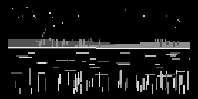

# Avonlea



_A tranquil ambient sketch for norns._  
Inspired by the Lake of Shining Waters in **Anne of Green Gables**.

> "...as if the water were past all modes and tenses of emotion..."

---

## Concept

Avonlea captures the stillness of a night lake,  
where moonlight and weather drift softly from  
Prince Edward Island into a quiet, glowing box.

---

## Features

- Moon and weather shape tone and light
- Glints, stars, and reeds respond to wind
- Calm invites soft melody; storms quiet it
- Shooting stars cross clear skies

---

## Controls

- **E1**: Wind
- **E2**: Depth
- **E3**: Glint
- **K2**: Cycle weather
- **K3**: Refresh sky

---

## Install

```
;install https://github.com/kurogedelic/avonlea
```

---

## Changelog

### v1.0.1
- Enhanced E2 (Depth) control for more dramatic tonal changes
  - Expanded filter range from 200Hz to 8200Hz (previously 2000-4000Hz)
  - Depth now affects frequency balance and warmth more significantly
  - Increased bass boost and high frequency reduction at higher depth settings

### v1.0.0
- Initial release

---

## Credits

Script / Sound: @kurogedelic  
Weather: Open-Meteo  
Inspiration: L. M. Montgomery  
Lines thread: https://llllllll.co/t/avonlea/71994
